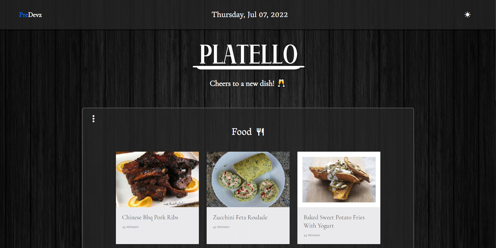
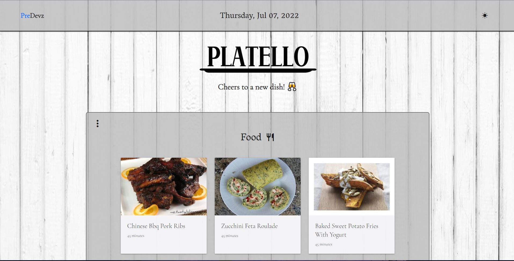

# Platello

Platello is a web application that randomly generates food and drinks with their recipes based on the user's liking. When nothing is stored in localstorage, then the user is new and we will greet them with styled modals and ask about their preferences for dishes, and what they don't like, as well as the drinks from a base ingredient. From there, an API will be called that will randomly return 3 meals related to their likings. And below that, another API will be called to return 3 drinks as well. Once the user has clicked on the boxes (one meal and one drink), another section will appear showing the user's food/drink along with their ingredients and recipes. The user will eventually be able to favorite a box if they enjoyed the dish in a later update, which will be stored in localstorage, and will be displayed in the favorite section (at the bottom) for their next visit.

## Links
[Platello]

[Platello-GitHub]

[Platello-GitHub]: https://github.com/PreDevz/Platello

[Platello]: https://predevz.github.io/Platello/
## PreDevz Team
[Cesar-Infante]

[Gilberto-Escobedo]

[Anthony-Quinones]

[Christian-McIlvenny]

[Christian-McIlvenny]: https://github.com/TDGNate  

[Anthony-Quinones]: https://github.com/TonyQ032

[Gilberto-Escobedo]: https://github.com/n7-gil

[Cesar-Infante]: https://github.com/Cesar-Infante
## Website Pictures

- Dark Mode

- Light Mode

