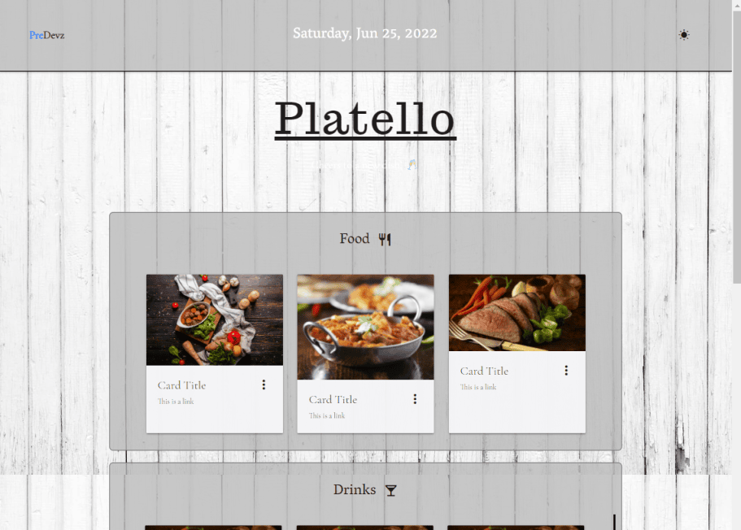

# Platello

A website that randomly generates food and drinks with their recipes based on the user's liking.
When nothing is stored in localstorage, then the user is new and we will greet them with styled modals asking what they would like on their dish, and what they don't like, same for the drinks. From there, an API will be called that will randomly return 3 meals related to what the user prefers on their dish. And below that, another API will be called to return 3 drinks as well. Once the user has clicked on the boxes (one meal and one drink), then another section will appear showing the user's food/drink along with their ingredients and recipes. The user is also able to favorite a box if they enjoyed the dish, which will be stored in localstorage, and will be displayed in the favorite section (at the bottom) for their next visit.

## Website Pictures

- Dark Mode

- Light Mode

