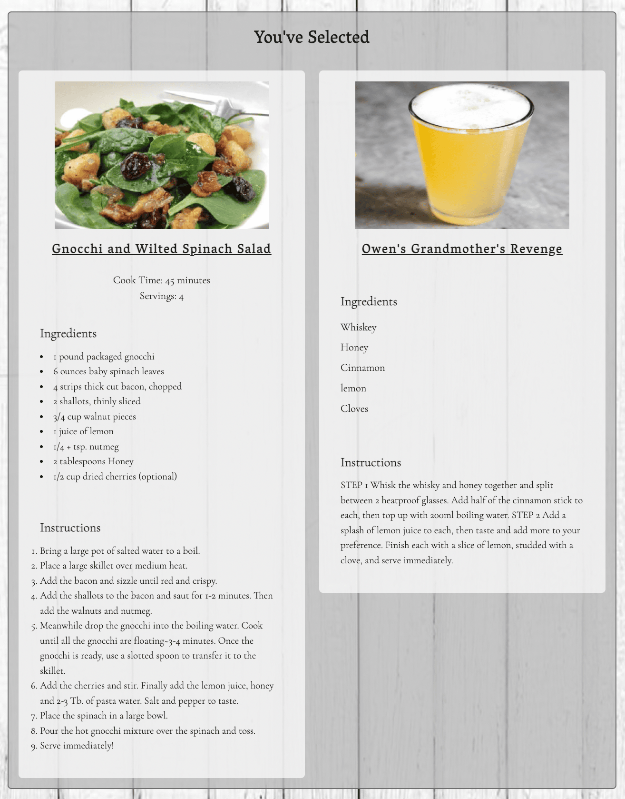

# Platello

## Overview
Platello is a web application that randomly generates food and drink recipes based on the user's preferences. 

Upon loading the page, the site checks localStorage to determine if the user is new or a recurring guest. If the user is new to the site then a styled modal is presented to them and asks about their preferences for dishes, any exclusions, as well as drinks from a base alcohol. From there, an API will be called that will randomly return 3 meals related to their likings. And below that, another API will be called to return 3 drinks as well. Once the user has clicked on the boxes (one meal and one drink), another section will appear showing the user's food/drink along with their ingredients and recipes. 

The user is then able to change their preferences and have new recipes generated based on their updated preferences.

## Frameworks and APIs
Platello utilized the following Frameworks:
- [Materialize CSS](https://materializecss.com/)
- [jQuery](https://jquery.com/)

## Future features
- The user will eventually be able to favorite a box if they enjoyed the dish in a later update, which will be stored in localstorage, and will be displayed in the favorite section (at the bottom) for their next visit.

- New recipes will cycle daily without the need for user input.

## Links
[Platello]

[Platello-GitHub]

[Platello-GitHub]: https://github.com/PreDevz/Platello

[Platello]: https://predevz.github.io/Platello/
## PreDevz Team
[Cesar-Infante]

[Gilberto-Escobedo]

[Anthony-Quinones]

[Christian-McIlvenny]

[Christian-McIlvenny]: https://github.com/TDGNate  

[Anthony-Quinones]: https://github.com/TonyQ032

[Gilberto-Escobedo]: https://github.com/n7-gil

[Cesar-Infante]: https://github.com/Cesar-Infante
## Website Pictures

- Dark Mode

- Light Mode

